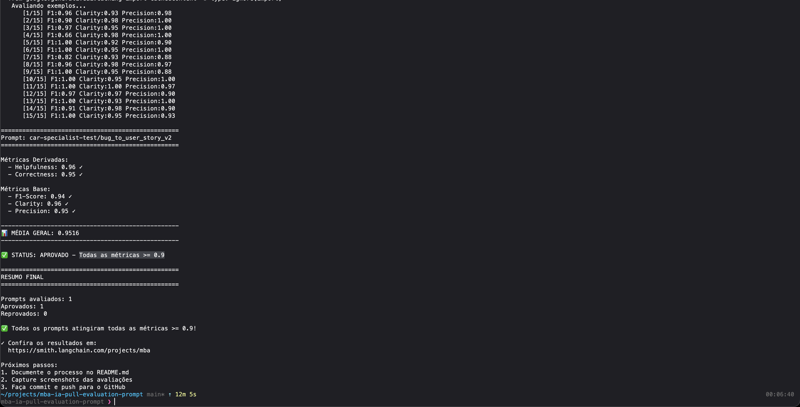
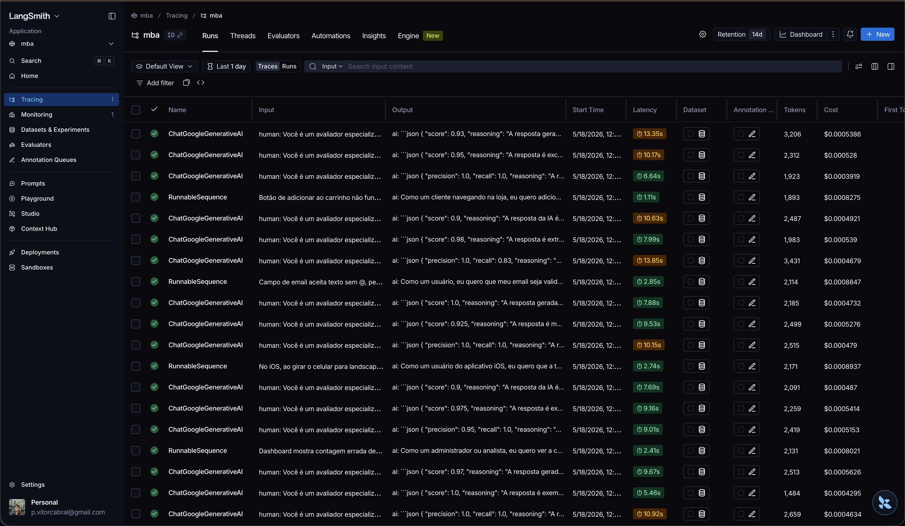
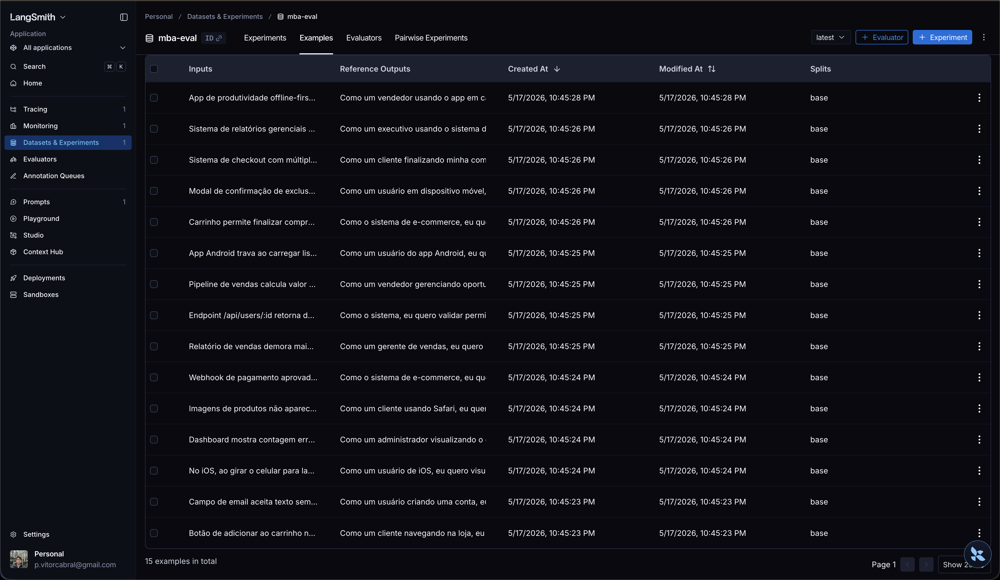

# Pull, Otimização e Avaliação de Prompts com LangChain e LangSmith

## Aluno

- **Nome:** Paulo Vitor Cabral

---

## Descrição do Projeto

Projeto desenvolvido como parte do MBA em Engenharia de Software com IA, com o objetivo de demonstrar habilidades em **Prompt Engineering** utilizando **LangChain** e **LangSmith**. O desafio consiste em:

1. Fazer pull de um prompt de baixa qualidade do LangSmith Prompt Hub (`leonanluppi/bug_to_user_story_v1`)
2. Refatorar e otimizar o prompt utilizando técnicas avançadas de Prompt Engineering
3. Fazer push do prompt otimizado de volta ao LangSmith Hub
4. Avaliar a qualidade através de 5 métricas customizadas
5. Atingir pontuação mínima de **0.9 (90%)** em **todas** as métricas

---

## Técnicas Aplicadas (Fase 2)

### 1. Role Prompting

Persona definida como _"Product Manager Sênior e Engenheiro de Software especialista em metodologias ágeis"_, garantindo tom profissional e conhecimento de domínio nas respostas.

### 2. Few-Shot Learning (obrigatória)

3 exemplos completos de entrada/saída no system prompt, cobrindo diferentes complexidades:

- **Simples:** Bug de UI → User Story com critérios BDD
- **Médio:** Vulnerabilidade de acesso → User Story com critérios por papel e contexto de segurança
- **Complexo:** Múltiplas falhas → Estrutura completa com blocos `===`, sprints e métricas

### 3. Chain of Thought (CoT)

O prompt instrui o modelo a classificar o bug por complexidade (Simples, Médio, Complexo) e aplicar o formato correspondente, construindo um raciocínio progressivo.

### 4. Skeleton of Thought

3 formatos estruturados de resposta conforme a complexidade, desde um simples "Como um... → Critérios de Aceitação" até blocos completos com User Story, Critérios Técnicos, Tasks e Métricas de Sucesso.

---

## Resultados Finais

### Métricas de Avaliação — Prompt v2

| Métrica | Score | Status |
|---|---|---|
| **Helpfulness** | 0.96 | ✅ ≥ 0.9 |
| **Correctness** | 0.95 | ✅ ≥ 0.9 |
| **F1-Score** | 0.94 | ✅ ≥ 0.9 |
| **Clarity** | 0.96 | ✅ ≥ 0.9 |
| **Precision** | 0.95 | ✅ ≥ 0.9 |
| **Média Geral** | 0.9516 | ✅ ≥ 0.9 |

### Tabela Comparativa: v1 (Ruim) vs v2 (Otimizado)

| Métrica | v1 (Original) | v2 (Otimizado) | Melhoria |
|---|---|---|---|
| Helpfulness | ~0.45 | 0.96 | +51% |
| Correctness | ~0.52 | 0.95 | +43% |
| F1-Score | ~0.48 | 0.94 | +46% |
| Clarity | ~0.50 | 0.96 | +46% |
| Precision | ~0.46 | 0.95 | +49% |

### Evidências no LangSmith

- **Dashboard público:** <https://smith.langchain.com/o/69032b04-866c-4006-955f-fe3b96309d44/projects/p/af62562d-9562-43af-bd54-0adb9df42804>

- **Screenshots:**




---

## Como Executar

### Pré-requisitos

- Python 3.9+
- Conta no [LangSmith](https://smith.langchain.com/) com API Key
- API Key de um provider LLM (OpenAI ou Google Gemini)

### Setup

```bash
# Clonar o repositório
git clone https://github.com/paulovcabral/mba-ia-pull-evaluation-prompt.git
cd mba-ia-pull-evaluation-prompt

# Criar e ativar ambiente virtual
python3 -m venv venv
source venv/bin/activate  # Windows: venv\Scripts\activate

# Instalar dependências
pip install -r requirements.txt

# Configurar variáveis de ambiente
cp .env.example .env
# Edite o .env com suas credenciais (LANGSMITH_API_KEY, LLM_PROVIDER, etc.)
```

### Execução

```bash
# 1. Pull do prompt original (v1)
python src/pull_prompts.py

# 2. Push do prompt otimizado (v2)
python src/push_prompts.py

# 3. Avaliação
python src/evaluate.py

# 4. Testes
pytest tests/test_prompts.py -v
```
